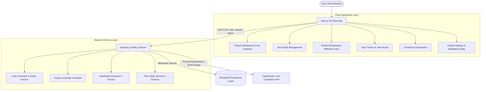

# Archer

Archer is an AI-powered System Design and Technical Project Planning Platform. It translates high-level software concepts and natural language product specifications into structured software architecture blueprints, technology stack recommendations, milestone roadmaps, actionable task lists, and interactive development environments.

Archer bridges the gap between project ideation and software execution. By leveraging Large Language Models (LLMs) with automated JSON schema validation and defensive response repair engines, Archer provides software engineers, project managers, and technical teams with a complete blueprint to guide application development from initial setup to deployment.

---

## Core Modules and Capabilities

### 1. AI System Blueprint Generation
- Translates plain-text project proposals into structured system architecture specifications.
- Identifies system boundaries, data flow patterns, core component responsibilities, and external service requirements.
- Generates data models, analysis records, and system specifications automatically upon project creation.

### 2. Intelligent Tech Stack Advisory Engine
- Recommends tailored frontend, backend, database, authentication, and cloud infrastructure choices based on project scope, target experience level, and application type.
- Provides detailed rationale for selected technologies along with potential trade-offs and component alternatives.
- Supports interactive tech stack management, allowing users to dynamically add, edit, or remove technologies within specific categories (Frontend, Backend, Database, Authentication, Other Services).

### 3. Phased Development Roadmap
- Automatically decomposes complex projects into sequential execution phases (e.g., Environment Setup, Core API Development, Authentication Layer, Deployment).
- Breaks each phase down into individual tasks with estimated effort hours, priority levels (Low, Medium, High), task difficulty ratings, and prerequisite dependency mappings.
- Implements defensive JSON repair logic to handle LLM response truncations and ensure valid roadmap generation even with strict token limits.

### 4. Interactive Live Viewport Dashboard
- Provides an embedded browser preview viewport within the main project dashboard.
- Displays live application states using embedded iFrames when a live deployment URL is configured.
- Gives developers instant visual feedback on active deployments directly alongside project metrics and quick navigation cards.

### 5. Context-Aware AI Project Assistant
- Integrates a dedicated project assistant backed by OpenRouter LLM infrastructure.
- Uses project metadata, selected tech stack, and current roadmap state as prompt context for real-time architectural advice, code generation, and task guidance.

### 6. Task Management System
- Offers a task tracking interface to organize todo items, work in progress, and completed features.
- Enables task filtering by status, priority, and phase alignment.

### 7. Comprehensive Project Settings
- Configurable metadata management covering Project Name, Description, Project Type (Web Application, Mobile App, Desktop App, API Service, CLI Tool, AI/ML Project, Fullstack App), Experience Level, Workflow Status, Progress %, Live URL, and GitHub Repository URL.

### 8. Authentication and Access Control
- Provides multi-tenant project isolation secured by JSON Web Token (JWT) session tokens and optional Google OAuth 2.0 single sign-on.

---

## System Architecture

The following diagram illustrates the interaction flow between the client application, backend server, database, and OpenRouter AI completion pipeline:



---

## Directory Structure

```
Archer/
├── client/                     # Next.js 16 Frontend Application
│   ├── app/                    # App Router Pages & Layouts
│   │   ├── (auth)/             # Authentication pages (Login, Register)
│   │   ├── dashboard/          # User Dashboard & Project List
│   │   └── project/[id]/       # Dynamic Project Workspace
│   │       ├── analysis/       # Project Code & Architecture Analysis
│   │       ├── architecture/   # System Architecture Diagrams & Schema
│   │       ├── assistant/      # Contextual AI Chat Workspace
│   │       ├── overview/       # Project Summary
│   │       ├── progress/       # Sprint & Completion Analytics
│   │       ├── roadmap/        # Interactive Phased Roadmap
│   │       ├── settings/       # Project Configuration & URLs
│   │       ├── tasks/          # Task & Todo Management
│   │       └── tech-stack/     # Technology Stack Management
│   ├── components/             # Reusable UI Components
│   │   ├── Layout/             # Sidebar, Header, Navigation
│   │   ├── Popup/              # Modal & Toast Notification System
│   │   ├── Projects/           # New Project Modals & Cards
│   │   ├── Settings/           # Update Project Settings Form
│   │   ├── Tasks/              # Task Item Cards & Filters
│   │   └── TechStack/          # Add/Remove Tech Stack Modals
│   ├── context/                # React Context Providers (User, Popup)
│   ├── utils/                  # Cookie management & API Client Helpers
│   └── package.json            # Frontend Dependencies & Scripts
│
└── server/                     # Express.js Backend API Server
    ├── controllers/            # Request Handlers (Auth, Project, Roadmap, Tasks)
    ├── middlewares/            # Auth Middleware (JWT Token Validation)
    ├── models/                 # Mongoose Schemas (User, Project, Roadmap, TechStack, Chat)
    ├── prompts/                # Centralized AI System Prompts & Templates
    ├── routes/                 # Express Router Definitions
    ├── services/               # Core Services (OpenRouter AI, Tech Stack Service)
    ├── utils/                  # Server Utilities & Helpers
    ├── index.ts                # Application Entry Point
    └── package.json            # Backend Dependencies & Scripts
```

---

## Technology Stack

| Category | Technology | Usage Description |
| :--- | :--- | :--- |
| **Frontend Framework** | Next.js 16 (App Router) | Server-rendered & client-side interactive React pages |
| **Frontend UI Library** | React 19, Tailwind CSS v4 | Responsive UI with modern dark mode styling |
| **Animations & Icons** | Framer Motion, Lucide React | Dynamic transitions and interface iconography |
| **Backend Runtime** | Node.js, Express.js (v5) | RESTful API server architecture |
| **Language** | TypeScript | Full type safety across server and client layers |
| **Database Layer** | MongoDB, Mongoose ODM | Document storage for users, projects, roadmaps, and tasks |
| **AI Completion Provider**| OpenRouter API | Integration with LLMs (Google Gemini, Anthropic Claude, GPT) |
| **Authentication** | JWT, `@react-oauth/google` | Token-based session management and Google OAuth login |

---

## Getting Started

### Prerequisites

Ensure the following environments are installed on your system:
- **Node.js**: Version `18.0.0` or higher
- **npm** or **yarn** package manager
- **MongoDB**: Active local MongoDB service (`mongodb://127.0.0.1:27017`) or a remote MongoDB Atlas URI.

---

### Step-by-Step Installation

#### 1. Repository Setup
```bash
git clone https://github.com/abhishekkksharma/Archer.git
cd Archer
```

#### 2. Server Configuration & Startup
Navigate to the `server` directory and install dependencies:
```bash
cd server
npm install
```

Create a `.env` file in the `server` root directory with the following variables:
```env
PORT=5000
MONGODB_URI=mongodb://127.0.0.1:27017/archer
JWT_SECRET=your_jwt_secret_key
GOOGLE_CLIENT_ID=your_google_oauth_client_id
CLIENT_URL=http://localhost:3000
OPENROUTER_API_KEY=your_openrouter_api_key
OPENROUTER_MODEL=openrouter/free
OPENROUTER_MAX_TOKENS=3000
```

Start the backend server in development mode:
```bash
npm run dev
```
The server will initialize and listen on `http://localhost:5000`.

#### 3. Client Configuration & Startup
In a separate terminal window, navigate to the `client` directory and install dependencies:
```bash
cd client
npm install
```

Create a `.env.local` file in the `client` root directory:
```env
NEXT_PUBLIC_BACKEND_URL=http://localhost:5000/api
NEXT_PUBLIC_GOOGLE_CLIENT_ID=your_google_oauth_client_id
```

Start the Next.js development server:
```bash
npm run dev
```
Access the application by navigating to `http://localhost:3000` in your web browser.

---

## Environment Variable Reference

### Server Environment Variables (`/server/.env`)

- `PORT`: Port number for the Express API server (default: `5000`).
- `MONGODB_URI`: Connection string for the MongoDB instance.
- `JWT_SECRET`: Secret key used to sign and verify JSON Web Tokens.
- `GOOGLE_CLIENT_ID`: Google OAuth 2.0 Client ID for authentication verification.
- `CLIENT_URL`: Origin URL of the frontend application allowed by CORS.
- `OPENROUTER_API_KEY`: API key for accessing OpenRouter LLM completion endpoints.
- `OPENROUTER_MODEL`: Target model identifier for AI roadmap and prompt generation.
- `OPENROUTER_MAX_TOKENS`: Maximum output tokens allowed per AI request.

### Client Environment Variables (`/client/.env.local`)

- `NEXT_PUBLIC_BACKEND_URL`: Public HTTP URL of the backend API server.
- `NEXT_PUBLIC_GOOGLE_CLIENT_ID`: Client ID for the Google OAuth React component.

---

## API Endpoint Reference

### Authentication Endpoints
| HTTP Method | Route Endpoint | Access | Purpose |
| :--- | :--- | :--- | :--- |
| `POST` | `/api/auth/register` | Public | Register a new user with email and password |
| `POST` | `/api/auth/login` | Public | Authenticate user and issue JWT token |
| `POST` | `/api/auth/google` | Public | Authenticate or register user via Google OAuth |
| `GET` | `/api/auth/me` | Protected | Fetch currently authenticated user profile |

### Project Management Endpoints
| HTTP Method | Route Endpoint | Access | Purpose |
| :--- | :--- | :--- | :--- |
| `GET` | `/api/project` | Protected | Retrieve list of all projects belonging to user |
| `POST` | `/api/project` | Protected | Create a new project and trigger AI blueprint generation |
| `GET` | `/api/project/:id` | Protected | Retrieve full project details, tech stack, and roadmap |
| `PUT` | `/api/project/:id` | Protected | Update project metadata, status, progress, or links |
| `DELETE` | `/api/project/:id` | Protected | Delete project and remove project reference from user |

### Tech Stack Endpoints
| HTTP Method | Route Endpoint | Access | Purpose |
| :--- | :--- | :--- | :--- |
| `POST` | `/api/project/:id/tech-stack` | Protected | Add a new technology component to a project stack |
| `DELETE` | `/api/project/:id/tech-stack` | Protected | Remove a technology component from a project stack |

### Roadmap & Task Endpoints
| HTTP Method | Route Endpoint | Access | Purpose |
| :--- | :--- | :--- | :--- |
| `GET` | `/api/roadmap/:projectId` | Protected | Fetch roadmap phases and task milestones |
| `POST` | `/api/roadmap/generate` | Protected | Trigger AI generation of project roadmap |
| `GET` | `/api/tasks/:projectId` | Protected | Fetch tasks list for a project |
| `POST` | `/api/tasks/:projectId` | Protected | Create a new task item within a project |
| `PUT` | `/api/tasks/:taskId` | Protected | Update task completion status, priority, or details |

---

## License

This repository is distributed under the [ISC License](LICENSE).